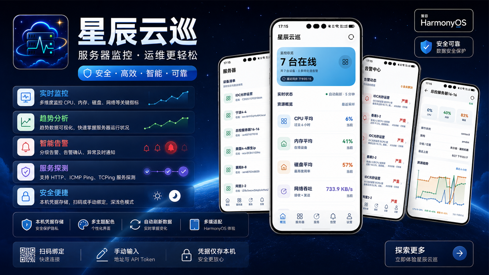
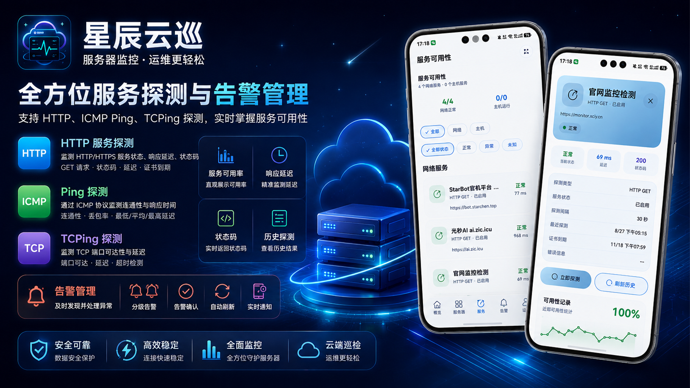

# 星辰云巡

> HarmonyOS 服务器监控客户端：把服务器状态、历史趋势、服务探测和告警动态装进口袋。

## 立即体验

**[前往华为应用市场安装星辰云巡](https://appgallery.huawei.com/app/detail?id=cn.xciy.xcyx&channelId=SHARE&source=appshare)**

也可以使用 HarmonyOS 设备扫描下方二维码：

## 核心能力

- **多空间管理**：添加、切换和管理多个监控空间，集中查看不同服务器环境。
- **实时资源监控**：掌握 CPU、内存、交换分区、负载、磁盘、网络与温度状态。
- **历史趋势分析**：用趋势数据快速定位负载变化和资源异常。
- **服务可用性探测**：支持 HTTP、ICMP Ping 和 TCPing，查看状态码、延迟与历史结果。
- **告警处理**：按状态和级别筛选告警，支持确认处理与实时事件同步。
- **安全连接**：支持扫码或手动绑定，API Token 使用 HarmonyOS Asset Store 保存在本机。
- **原生体验**：适配浅色、深色和多主题界面，兼顾紧凑屏与大屏设备。

## 开发环境

- DevEco Studio
- HarmonyOS SDK 6.1.0（API 23）
- Hvigor / OHPM

## 构建

1. 使用 DevEco Studio 打开项目根目录。
2. 等待依赖同步完成。
3. 在 DevEco Studio 中为本地构建配置自己的 HarmonyOS 签名证书。
4. 选择 `entry` 模块运行或构建。

签名证书、私钥、密码和本机配置不会随仓库分发。首次打开项目时，DevEco Studio 会根据本机环境生成 `local.properties`；签名材料请在本地管理，不要提交到 Git。

## 目录

- `entry/src/main/ets`：HarmonyOS 应用源码
- `entry/src/test`：本地单元测试
- `素材`：应用宣传图、推广素材和实机截图
- `mock-monitor.mjs`：本地接口模拟数据

## 隐私与安全

仓库已排除 `local.properties`、`.deveco`、构建输出、依赖缓存以及 `*.p12`、`*.p7b`、`*.cer`、`*.jks` 等签名材料。连接服务器时使用你自己的地址和 API Token；不要在源码、测试数据或提交信息中写入真实凭据。

应用隐私政策与用户协议位于 [`素材`](素材) 目录。

## 更多资料

- [版本更新记录](CHANGELOG.md)
- [宣传推广包](宣传推广包.md)
- [GitHub 开源仓库](https://github.com/Pstarchen/xingchenyunxun)
